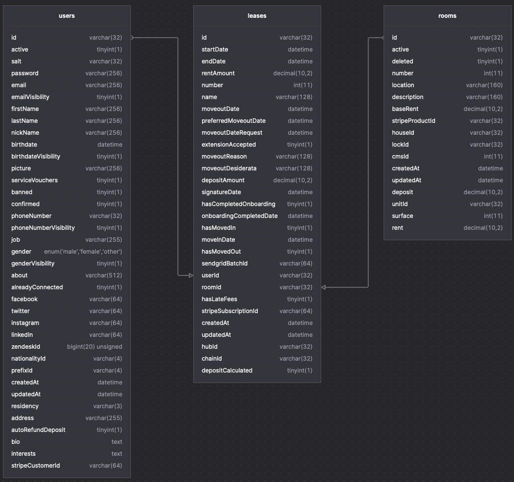

# Cohabs Support Challenge

Welcome in our support challenge, the goal of this exercices if to have an idea about your skill, but above all, to have a basis for discussions during our debriefing. This test does not need to be perfect, so there is no need to spend weeks finalizing it, a simple functional example and a good argument will be more than enough.

## Access Needed
- [https://www.notion.so/cohabs](https://www.notion.so/cohabs/Support-challenge-22bdbbf7563e4c2aa15c8b44dd3df186)
- https://dashboard.stripe.com

## Requirements
- docker / docker-compose
- node / yarn

## Setup and Run

For this exercices we provide a simple docker compose with a fresh mysql database. A `.env` file was also provided containing all the access needed during this exercices.

You can run the compose via this command:

`docker compose --env-file ./.env up`

You can start adding your code in the `index.ts` and you can execute your code via:

`yarn start`

## Cases

### **Support case:** Dispute payment and Rent not transferred

The purpose of this exercise is to test out your skills on a real-life use case. As you’re interviewing for a support engineer position, it naturally spans over little operations as well as DB and API integration work.

The challenge aims at making sure that we’ve got a clear understanding of your current back-end level and how you resolve a given issue/operation. **It’s important that you do your best** given the time constraints, so we can transparently assess whether you’re a good fit for the job.

We don’t expect you to know how to resolve the exercise beforehand, but we will evaluate how and why you came to the solution. Please list any assumptions that you made or try and clarify them with us. Just as for our future collaboration, you **should not be working in isolation.**

We invite you to take enough time to provide a **well-crafted solution.** We love reports, process, tracking **valuable information** and the initiative to create documentation. It would be **really cool if you could also surprise** us**.**

You can found all the related information here:
 - https://www.notion.so/cohabs/Support-challenge-22bdbbf7563e4c2aa15c8b44dd3df186

### **Technical case:** Sync our database on a fresh Stripe account

We have a dump of our database in this project `cohabs_onboarding.dump`. To begin can restore this dump. In this fresh database the link between our data and Stripe was missing. The goal of this exercices was to recreate and save the link between our entities and Stripe.

To begin a quick explanation about our database and his structure:

As you can see, we have an user, signing a lease for a specific rooms.
For each of this entities, we want to have the related entities on Stripe:

- For each `user` we want a `customer` on Stripe containing all the relevant informations contained in our users table. 
- For each `room` we want a `product with a price` on Stripe, you can found the value of the price in the `baseRent` column.
- For each `lease` we want an `subscription` on Stripe making the link between the customer and the product.

The goal was to recreate all the missing entities on Stripe, get the id in the response, and store the related id in our database:

- In the `users` table, you need to store the customer id in `stripeCustomerId`.
- In the `rooms` table, you need to store the product id in `stripeProductId`.
- In the `lease` table, you need to store the subscription id in `stripeSubscritpionId`.
